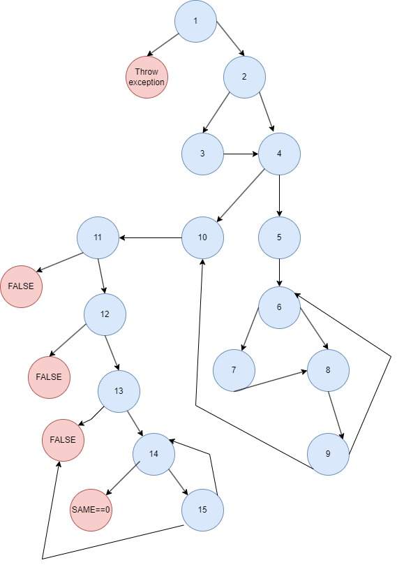

# SI_2023_lab2_135044

## Никола Тимов, бр. на индекс 135044

###  Control Flow Graph

###  Цикломатска комплексност

Формула за сметање
CK = E - N + 2P
CK = 25 - 20 + 10  = 15

Цикломатската комплексност на овој код е 15 
Буквата Е означува број на рабовите кои ги поврзуваат јазлите 25. 
Буквата N означува број на јазли во графот 20. 
Буквата P означува број делови од графот кои се исклучуваат или со други зборови каде што програмата ни паѓа или завршува = 5

### Објаснување на напишаните unit tests

#### Тест случаи според критериумот Multiple Condition

за условот if (user==null || user.getPassword()==null || user.getEmail()==null)

- >условот го прави проверува следното:
Aко имаме празен обијект од класа User, или имаме обијект од класа User но password или email ни се null кодот треба да фрли исклучок со порака и да прекине.
Само доколку имаме не-празен обијект од класа User со password И email различни од null кодот ќе продожи кон следниот јазол односно јазол 2

за точно да го истестираме условот треба избереме вредности каде што ќе ги поминеме сите можни комбинации на вистиносни вредности за условите, кои имаат логичка смисла да се извршат.

##### Тест 1:
празен објект од класа User 
user==null 
Резултат: кодот ќе фрли исклучок со порака "Mandatory information missing!" и ќе прекине 

##### Тест 2:
имаме објект од класа User : 
user = new User("Nikola", null, null) 
Резултат: Бидејќи во обијектот имаме празен password и email но username ни е различно од null, 
кодот повторно фрли исклучок со порака "Mandatory information missing!" и ќе прекине. 

##### Тест 3:
имаме објект од класа User : 
user = new User("Nikola", null, "nikola.timo@finki.com") 
Резултат: Бидејќи во обијектот имаме празен password и покрај тоа што email и username ни е различно од null, 
кодот повторно фрли исклучок со порака "Mandatory information missing!" и ќе прекине заради не исполент 2 услов (user.getPassword()==null). 

##### Тест 4:
имаме објект од класа User : 
user = new User("Nikola", "lozinka", null) 
Резултат: Бидејќи во обијектот имаме празен email и покрај тоа што password и username(кодот не го интересира дали username е null) ни е различно од null, 
кодот повторно фрли исклучок со порака "Mandatory information missing!" и ќе прекине заради не исполент 2 услов (user.getEmail()==null). 

##### Тест 5:
имаме објект од класа User : 
user = new User("Nikola", "lozinka", "nekojemail@hotmail.com") 
Резултат: Бидејќи имаме обијект во кој password и email se <> null, кодот ќе продолжи кон јазол следниот јазол односно јазол бр.2  

#### Тестови според критериумот Every branch

##### Тест 6:
Тестот ќе ги измине следните јазли 1,2,3,4,6,7,8,9,10,11,12,13,14,15,SAME==0 
Каде што програмата успешно ќе заврши со True.(jaзол same==0) 
Што значи дека username ќе ја има вредноста на email, (јазли 1,2,3) 
дека нема да постои ниту еден username или емаил дупликат ( јазли 4,5,6,7,8,9) 
лозинакта нема да е иста со username, и помала од 8 карактери (јазли 11,12,13) 
лозинката ќе биде со специјален карактер и нема да има празно место (јазли 14,15,same==0) 